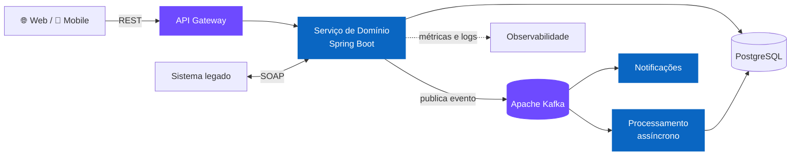

  
  
  

Construo e lidero a construção de **sistemas de backend que precisam ficar de pé**: alto volume, integrações assíncronas e times que mudam ao longo do caminho. Minha régua não é "funcionou na minha máquina" — é entregar software que o próximo time consegue evoluir.

<table>
  <tr>
    <td width="50%" valign="top">
      <h3>🏗️ Arquitetura que sustenta o negócio</h3>
      Serviços em Java/Spring Boot com Clean Architecture, separando domínio de infraestrutura — trocar banco, fila ou provedor não vira um projeto de seis meses.
    </td>
    <td width="50%" valign="top">
      <h3>🔄 Integrações que não derrubam o sistema</h3>
      Comunicação assíncrona com Kafka e RabbitMQ: quando um serviço cai, a fila segura o baque em vez de o cliente ver erro.
    </td>
  </tr>
  <tr>
    <td width="50%" valign="top">
      <h3>🚀 Entrega previsível</h3>
      Pipelines de CI/CD no Azure DevOps tiram o deploy do caminho crítico do time — menos "sexta-feira de subida", mais rotina.
    </td>
    <td width="50%" valign="top">
      <h3>🤝 Time mais forte do que quando cheguei</h3>
      Trade-offs documentados, code review como parte da entrega e mentoria de devs em início de carreira.
    </td>
  </tr>
</table>

---

## 🧩 Como eu construo

Uma arquitetura de referência que costumo aplicar — e que explica a maior parte dos repositórios aqui embaixo:

| Princípio | Na prática |
| --- | --- |
| **O domínio não conhece o framework** | Se trocar Spring por outra coisa quebra a regra de negócio, o desenho está errado. |
| **Evento é contrato** | Mudança de payload é versionada — não é "ajuste rápido em produção". |
| **Idempotência não é opcional** | Consumidor de fila reprocessa mensagem. Sempre. Projete para isso. |
| **Legado se isola, não se xinga** | Camada anticorrupção sobre o SOAP, e o resto do sistema segue evoluindo. |
| **Teste é documentação executável** | Caso de uso sem teste não está pronto. |

➡️ Ver no código: [`clean-architeture-album`](https://github.com/kaiofelixdeoliveira/clean-architeture-album) · [`kafka-consumer`](https://github.com/kaiofelixdeoliveira/kafka-consumer) · [`starter-webservice-soap`](https://github.com/kaiofelixdeoliveira/starter-webservice-soap)

---

## ⚙️ Stack

| | |
| --- | --- |
| **Backend** |     |
| **Mensageria** |    |
| **Cloud & DevOps** |    |
| **Dados** |    |
| **Front & Mobile** |     |

---

## 📌 Projetos em destaque

| Projeto | O que é | Stack |
| --- | --- | --- |
| [**clean-architeture-album**](https://github.com/kaiofelixdeoliveira/clean-architeture-album) ⭐ 11 | Referência prática de Clean Architecture em Java — separação de camadas, casos de uso e inversão de dependência. Meu repositório mais estrelado. | `Java` `Spring Boot` |
| [**kafka-producer**](https://github.com/kaiofelixdeoliveira/kafka-producer) · [**kafka-consumer**](https://github.com/kaiofelixdeoliveira/kafka-consumer) | Base de comunicação assíncrona com Apache Kafka: publicação e consumo de eventos prontos para reuso. | `Java` `Kafka` |
| [**rabbitmq-producer**](https://github.com/kaiofelixdeoliveira/rabbitmq-producer) · [**rabbitmq-consumer**](https://github.com/kaiofelixdeoliveira/rabbitmq-consumer) | Mesma ideia sobre AMQP: filas, consumidores e resiliência de mensagens com RabbitMQ. | `Java` `RabbitMQ` |
| [**azure-devops-pipeline**](https://github.com/kaiofelixdeoliveira/azure-devops-pipeline) | Pipeline de CI/CD no Azure DevOps para aplicações Java — build, testes e deploy automatizados. | `Azure DevOps` `Java` |
| [**projeto-contas**](https://github.com/kaiofelixdeoliveira/projeto-contas) | API de operações bancárias: consulta de saldo e transferência entre contas. | `Java` `Spring Boot` |
| [**stream-video-api**](https://github.com/kaiofelixdeoliveira/stream-video-api) · [**stream-video-app**](https://github.com/kaiofelixdeoliveira/stream-video-app) | API de streaming de vídeo com aplicativo mobile consumindo o serviço. | `Java` `Flutter` |
| [**starter-webservice-soap**](https://github.com/kaiofelixdeoliveira/starter-webservice-soap) | Ponto de partida para integração com web services SOAP — útil em cenários de legado. | `Java` `SOAP` |

> 🔭 **No que estou trabalhando agora:** um ecossistema de saúde e nutrição — API, aplicativo mobile e painel web para profissionais — com apoio de IA no acompanhamento do paciente. Domínio com regras de verdade, múltiplos clientes sobre o mesmo núcleo e dados que precisam estar certos, não só disponíveis.

---

## 📊 GitHub

<picture>
  <source media="(prefers-color-scheme: dark)" srcset="https://github-readme-stats.vercel.app/api?username=kaiofelixdeoliveira&show_icons=true&hide_border=true&include_all_commits=true&theme=tokyonight" />
  
</picture>
<picture>
  <source media="(prefers-color-scheme: dark)" srcset="https://github-readme-stats.vercel.app/api/top-langs/?username=kaiofelixdeoliveira&layout=compact&langs_count=8&hide_border=true&theme=tokyonight" />
  
</picture>

<picture>
  <source media="(prefers-color-scheme: dark)" srcset="https://raw.githubusercontent.com/kaiofelixdeoliveira/kaiofelixdeoliveira/output/github-snake-dark.svg" />
  
</picture>

---

## 🤝 Vamos conversar

Aberto a trocas sobre **arquitetura de software, sistemas event-driven e liderança técnica** — e a oportunidades onde esses temas estejam no centro.

---

<b>🇺🇸 Read this profile in English</b>

 

I build — and lead the building of — **backend systems that have to stay up**: high volume, asynchronous integrations, and teams that change along the way. My bar isn't "works on my machine"; it's shipping software the next team can actually evolve.

- 🏗️ **Architecture that supports the business** — Java/Spring Boot services on Clean Architecture, keeping domain and infrastructure apart, so swapping a database, a queue or a provider doesn't become a six-month project.
- 🔄 **Integrations that don't take the system down** — asynchronous messaging with Kafka and RabbitMQ: when a service fails, the queue absorbs it instead of the customer seeing an error.
- 🚀 **Predictable delivery** — CI/CD pipelines on Azure DevOps keep deployment off the team's critical path.
- 🤝 **A stronger team than I found** — documented trade-offs, code review as part of delivery, and mentoring for junior developers.

**How I build:** the domain doesn't know the framework · an event is a contract · idempotency is not optional in a queue consumer · legacy gets isolated, not cursed at · tests are executable documentation.

**Stack:** `Java` · `Spring Boot` · `Node.js` · `Python` · `Kafka` · `RabbitMQ` · `REST & SOAP` · `AWS` · `Azure DevOps` · `PostgreSQL` · `MySQL` · `MongoDB` · `TypeScript` · `React` · `Angular` · `Flutter`

**Featured projects:** [`clean-architeture-album`](https://github.com/kaiofelixdeoliveira/clean-architeture-album) (Clean Architecture reference, my most starred repo) · [`kafka-producer`](https://github.com/kaiofelixdeoliveira/kafka-producer) / [`kafka-consumer`](https://github.com/kaiofelixdeoliveira/kafka-consumer) · [`rabbitmq-producer`](https://github.com/kaiofelixdeoliveira/rabbitmq-producer) / [`rabbitmq-consumer`](https://github.com/kaiofelixdeoliveira/rabbitmq-consumer) · [`azure-devops-pipeline`](https://github.com/kaiofelixdeoliveira/azure-devops-pipeline) · [`projeto-contas`](https://github.com/kaiofelixdeoliveira/projeto-contas) · [`starter-webservice-soap`](https://github.com/kaiofelixdeoliveira/starter-webservice-soap)

> 🔭 **Currently:** building a health and nutrition ecosystem (API, mobile app and web dashboard for professionals), using AI to support patient follow-up.

Let's talk: [LinkedIn](https://www.linkedin.com/in/kaio-felix-oliveira/) · [kaio.felix.oliveira.mail@gmail.com](mailto:kaio.felix.oliveira.mail@gmail.com)

