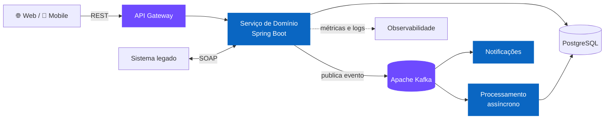

  
  
  
  

---

## 🧭 Escolha por onde começar

> Clique na seção que combina com você — cada uma leva menos de um minuto.

<b>🧑‍💼 Sou gestor ou recrutador</b> — o resumo em 30 segundos

 

**O que eu entrego**

| | |
| --- | --- |
| 🏗️ **Arquitetura que sustenta o negócio** | Desenho serviços em Java/Spring Boot com Clean Architecture, separando domínio de infraestrutura — para que trocar banco, fila ou provedor não vire um projeto de seis meses. |
| 🔄 **Integrações que não derrubam o sistema** | Comunicação assíncrona com Kafka e RabbitMQ: quando um serviço cai, a fila segura o baque em vez de o cliente ver erro. |
| 🚀 **Entrega previsível** | Pipelines de CI/CD no Azure DevOps tiram o deploy do caminho crítico do time — menos "sexta-feira de subida", mais rotina. |
| 🧩 **Produto de ponta a ponta** | Quando o time precisa, vou do backend ao front (React, Angular) e ao mobile (Flutter). Entrego o que o usuário usa, não só o endpoint. |
| 🤝 **Time mais forte do que quando cheguei** | Trade-offs documentados, code review como parte da entrega e mentoria de devs em início de carreira. |

**Como eu trabalho com stakeholders**

- Traduzo decisão técnica em consequência de negócio: prazo, custo e risco — não em jargão.
- Prefiro dizer "esse caminho nos custa X em manutenção" antes de escrever a primeira linha.
- Entrego em fatias que dá para validar, em vez de um big bang no fim do trimestre.

📄 Currículo completo e histórico profissional no **[LinkedIn](https://www.linkedin.com/in/kaio-felix-oliveira/)**.

<b>👨‍💻 Sou dev ou tech lead</b> — como eu construo software

 

**Uma arquitetura de referência que costumo aplicar:**

**Princípios que eu levo a sério**

- **O domínio não conhece o framework.** Se trocar Spring por outra coisa quebra a regra de negócio, o desenho está errado.
- **Evento é contrato.** Mudança de payload é versionada, não é "ajuste rápido em produção".
- **Idempotência não é opcional** em consumidor de fila — reprocessamento acontece.
- **Legado se isola, não se xinga.** Camada anticorrupção sobre o SOAP e o resto do sistema segue evoluindo.
- **Teste é documentação executável.** Se o caso de uso não tem teste, ele não está pronto.

**Onde ver isso no código:** [`clean-architeture-album`](https://github.com/kaiofelixdeoliveira/clean-architeture-album) (camadas e casos de uso) · [`kafka-consumer`](https://github.com/kaiofelixdeoliveira/kafka-consumer) (consumo de eventos) · [`starter-webservice-soap`](https://github.com/kaiofelixdeoliveira/starter-webservice-soap) (integração com legado).

<b>🔭 No que estou trabalhando agora</b>

 

Um **ecossistema de saúde e nutrição** — API, aplicativo mobile e painel web para profissionais — com apoio de IA no acompanhamento do paciente.

É o tipo de problema que gosto: domínio com regras de verdade, múltiplos clientes consumindo o mesmo núcleo e dados que precisam estar certos, não só disponíveis.

<b>☕ Fora do código</b>

 

- 📚 Leitura recorrente: arquitetura de software, sistemas distribuídos e tudo que ajude a errar menos em decisão cara de reverter.
- 🧪 Gosto de montar provas de conceito pequenas antes de defender uma escolha técnica — daí vêm boa parte dos repositórios aqui.
- 💬 Sempre aberto a trocar ideia sobre Kafka, Clean Architecture ou o eterno debate de monólito vs. microsserviços.

---

## ⚙️ Stack

**Backend**

**Mensageria &amp; Integração**

**Cloud &amp; DevOps**

**Dados**

**Front-end &amp; Mobile**

---

## 📌 Projetos em destaque

| Projeto | O que é | Stack |
| --- | --- | --- |
| [**clean-architeture-album**](https://github.com/kaiofelixdeoliveira/clean-architeture-album) ⭐ 11 | Referência prática de Clean Architecture em Java — separação de camadas, casos de uso e inversão de dependência. Meu repositório mais estrelado. | `Java` `Spring Boot` |
| [**kafka-producer**](https://github.com/kaiofelixdeoliveira/kafka-producer) · [**kafka-consumer**](https://github.com/kaiofelixdeoliveira/kafka-consumer) | Base de comunicação assíncrona com Apache Kafka: publicação e consumo de eventos prontos para reuso. | `Java` `Kafka` |
| [**rabbitmq-producer**](https://github.com/kaiofelixdeoliveira/rabbitmq-producer) · [**rabbitmq-consumer**](https://github.com/kaiofelixdeoliveira/rabbitmq-consumer) | Mesma ideia sobre AMQP: filas, consumidores e resiliência de mensagens com RabbitMQ. | `Java` `RabbitMQ` |
| [**azure-devops-pipeline**](https://github.com/kaiofelixdeoliveira/azure-devops-pipeline) | Pipeline de CI/CD no Azure DevOps para aplicações Java — build, testes e deploy automatizados. | `Azure DevOps` `Java` |
| [**projeto-contas**](https://github.com/kaiofelixdeoliveira/projeto-contas) | API de operações bancárias: consulta de saldo e transferência entre contas. | `Java` `Spring Boot` |
| [**stream-video-api**](https://github.com/kaiofelixdeoliveira/stream-video-api) · [**stream-video-app**](https://github.com/kaiofelixdeoliveira/stream-video-app) | API de streaming de vídeo com aplicativo mobile consumindo o serviço. | `Java` `Flutter` |
| [**starter-webservice-soap**](https://github.com/kaiofelixdeoliveira/starter-webservice-soap) | Ponto de partida para integração com web services SOAP — útil em cenários de legado. | `Java` `SOAP` |

  

---

## 📊 Métricas

<picture>
  <source media="(prefers-color-scheme: dark)" srcset="https://github-readme-stats.vercel.app/api?username=kaiofelixdeoliveira&show_icons=true&hide_border=true&include_all_commits=true&theme=tokyonight" />
  
</picture>
<picture>
  <source media="(prefers-color-scheme: dark)" srcset="https://streak-stats.demolab.com?user=kaiofelixdeoliveira&hide_border=true&theme=tokyonight" />
  
</picture>

<picture>
  <source media="(prefers-color-scheme: dark)" srcset="https://github-readme-stats.vercel.app/api/top-langs/?username=kaiofelixdeoliveira&layout=compact&langs_count=8&hide_border=true&theme=tokyonight" />
  
</picture>

<b>📈 Ver gráfico de atividade</b>

 

<picture>
  <source media="(prefers-color-scheme: dark)" srcset="https://github-readme-activity-graph.vercel.app/graph?username=kaiofelixdeoliveira&hide_border=true&theme=github-dark" />
  
</picture>

 

<picture>
  <source media="(prefers-color-scheme: dark)" srcset="https://raw.githubusercontent.com/kaiofelixdeoliveira/kaiofelixdeoliveira/output/github-snake-dark.svg" />
  
</picture>

---

## 🤝 Vamos conversar

Aberto a trocas sobre **arquitetura de software, sistemas event-driven e liderança técnica** — e a oportunidades onde esses temas estejam no centro.

---

<b>🇺🇸 Read this profile in English</b>

 

### 👋 About me

I build — and lead the building of — **backend systems that have to stay up**: high volume, asynchronous integrations, and teams that change along the way. My bar isn't "works on my machine"; it's shipping software the next team can actually evolve.

<b>🧑‍💼 I'm a manager or recruiter</b> — the 30-second version

 

- 🏗️ **Architecture that supports the business** — Java/Spring Boot services built on Clean Architecture, keeping domain and infrastructure apart so swapping a database, a queue or a provider doesn't become a six-month project.
- 🔄 **Integrations that don't take the system down** — asynchronous messaging with Kafka and RabbitMQ: when a service fails, the queue absorbs it instead of the customer seeing an error.
- 🚀 **Predictable delivery** — CI/CD pipelines on Azure DevOps keep deployment off the team's critical path.
- 🧩 **End-to-end product** — when the team needs it, I go from the backend to the front-end (React, Angular) and mobile (Flutter).
- 🤝 **A stronger team than I found** — documented trade-offs, code review as part of delivery, and mentoring for junior developers.

Full career history on **[LinkedIn](https://www.linkedin.com/in/kaio-felix-oliveira/)**.

<b>👨‍💻 I'm a developer or tech lead</b> — how I build software

 

- **The domain doesn't know the framework.** If replacing Spring breaks a business rule, the design is wrong.
- **An event is a contract.** Payload changes are versioned, not "a quick fix in production".
- **Idempotency is not optional** in a queue consumer — reprocessing happens.
- **Legacy gets isolated, not cursed at.** An anti-corruption layer over SOAP, and the rest of the system keeps evolving.
- **Tests are executable documentation.** A use case without tests isn't done.

See it in code: [`clean-architeture-album`](https://github.com/kaiofelixdeoliveira/clean-architeture-album) · [`kafka-consumer`](https://github.com/kaiofelixdeoliveira/kafka-consumer) · [`starter-webservice-soap`](https://github.com/kaiofelixdeoliveira/starter-webservice-soap)

> 🔭 **Currently:** building a health and nutrition ecosystem (API, mobile app and web dashboard for professionals), using AI to support patient follow-up.

### ⚙️ Stack

`Java` · `Spring Boot` · `Node.js` · `Python` · `Kafka` · `RabbitMQ` · `REST & SOAP` · `AWS` · `Azure DevOps` · `PostgreSQL` · `MySQL` · `MongoDB` · `TypeScript` · `React` · `Angular` · `Flutter`

### 📌 Featured projects

| Project | What it is | Stack |
| --- | --- | --- |
| [**clean-architeture-album**](https://github.com/kaiofelixdeoliveira/clean-architeture-album) ⭐ 11 | A hands-on Clean Architecture reference in Java — layer separation, use cases and dependency inversion. My most starred repository. | `Java` `Spring Boot` |
| [**kafka-producer**](https://github.com/kaiofelixdeoliveira/kafka-producer) · [**kafka-consumer**](https://github.com/kaiofelixdeoliveira/kafka-consumer) | Reusable foundation for asynchronous communication with Apache Kafka. | `Java` `Kafka` |
| [**rabbitmq-producer**](https://github.com/kaiofelixdeoliveira/rabbitmq-producer) · [**rabbitmq-consumer**](https://github.com/kaiofelixdeoliveira/rabbitmq-consumer) | Same idea over AMQP: queues, consumers and message resilience. | `Java` `RabbitMQ` |
| [**azure-devops-pipeline**](https://github.com/kaiofelixdeoliveira/azure-devops-pipeline) | CI/CD pipeline on Azure DevOps for Java applications. | `Azure DevOps` `Java` |
| [**projeto-contas**](https://github.com/kaiofelixdeoliveira/projeto-contas) | Banking operations API: balance lookup and transfers between accounts. | `Java` `Spring Boot` |
| [**stream-video-api**](https://github.com/kaiofelixdeoliveira/stream-video-api) · [**stream-video-app**](https://github.com/kaiofelixdeoliveira/stream-video-app) | Video streaming API with a mobile app consuming the service. | `Java` `Flutter` |

### 🤝 Let's talk

Happy to discuss **software architecture, event-driven systems and technical leadership** — and open to opportunities where those are at the core.

[LinkedIn](https://www.linkedin.com/in/kaio-felix-oliveira/) · [kaio.felix.oliveira.mail@gmail.com](mailto:kaio.felix.oliveira.mail@gmail.com)

